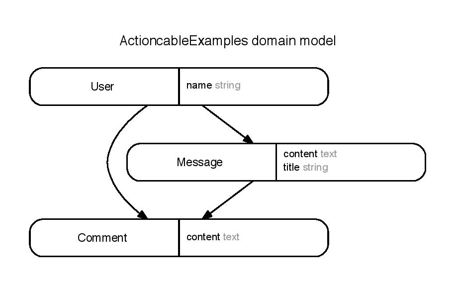

# Action Cable Chat

In this repo, I will learn how action cable works by analyzing the example code:
- [rails/actioncable-examples](https://github.com/rails/actioncable-examples)
- [excid3/actioncable-examples forked from rails/actioncable-examples
](https://github.com/excid3/actioncable-examples)

## Dependencies

You must have redis installed and running on the default port:6379 (or configure it in config/redis/cable.yml).

## Starting the servers

1. Run `./bin/setup`
2. Run `./bin/cable`
3. Open up a separate terminal and run: `./bin/rails server`
4. One more terminal to run redis server: `redis-server`
4. Visit `http://localhost:3000`

## Live comments example

1. Open two browsers with separate cookie spaces (like a regular session and an incognito session).
2. Login as different people in each browser.
3. Go to the same message.
4. Add comments in either browser and see them appear real-time on the counterpart screen.

